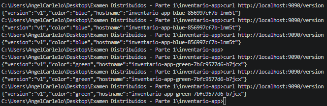
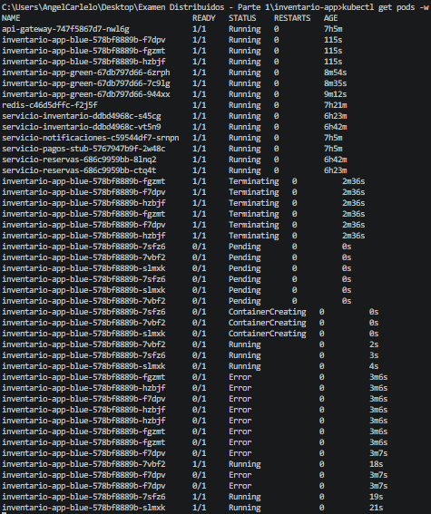
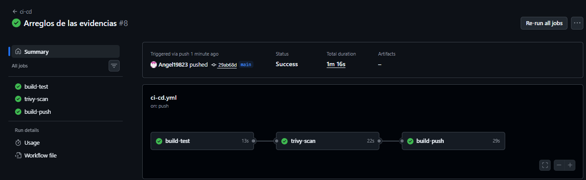
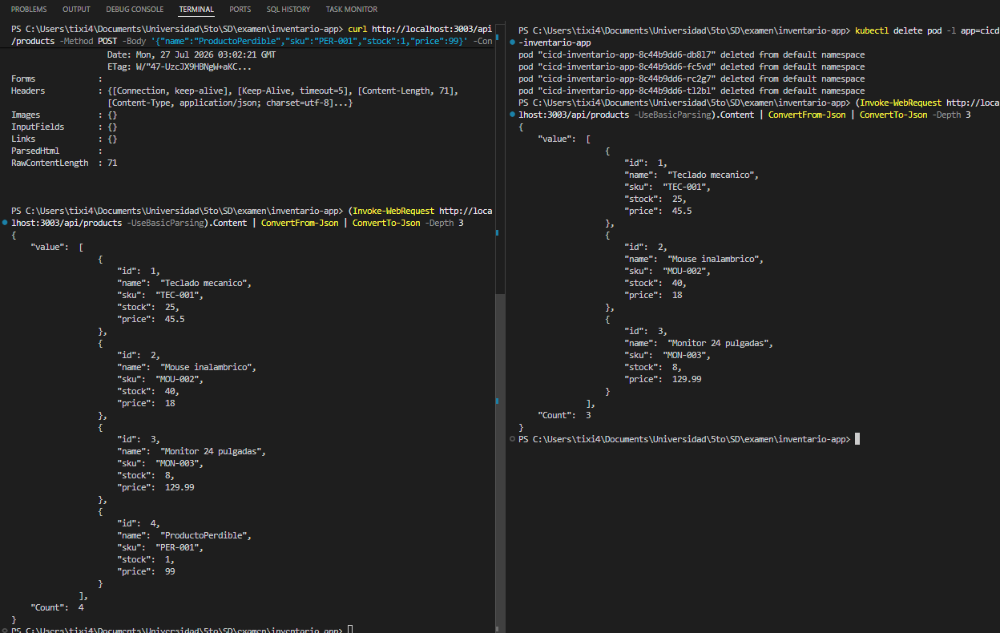

# Evidencias - Persona A: Jose Tixi

## Docker Build

## Health Check

## Version

## Products List

## Web UI

## Minikube Rollout

## Port Forward

## Secret Applied

## Secret Env

## Actions Pipeline

## GHCR Image

---

# Evidencias - Persona B: Angel Cardenas

**Correo:** acardenasl2@est.ups.edu.ec

## Blue-Green Traffic Cut

## Readiness with Startup Delay

## Trivy Security Scan

## Data Loss Demonstration

